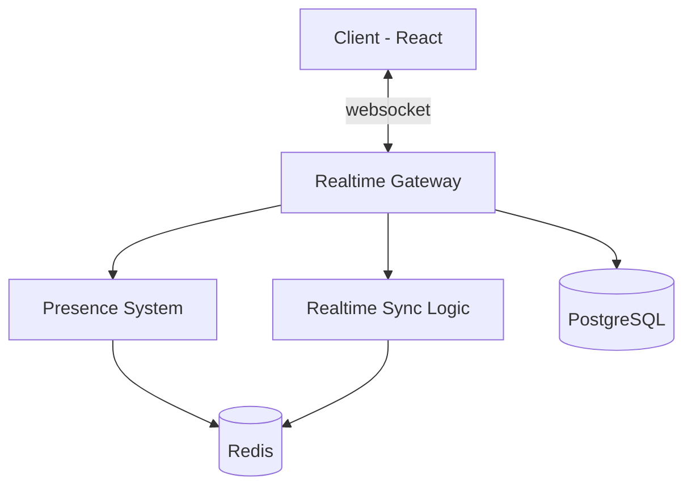
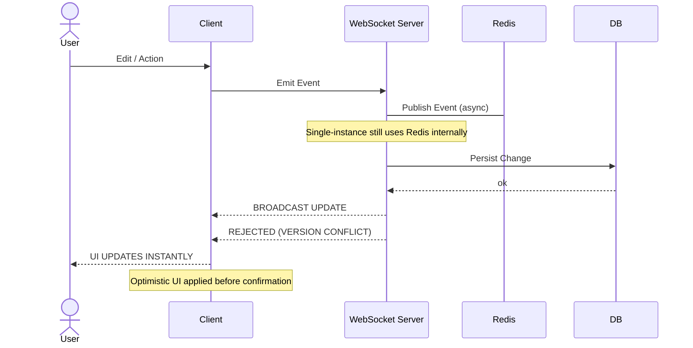

# Real-Time Collaboration Platform

Real-time collaboration platform developed to enable simultaneous interaction between multiple users, instant synchronization of changes, and presence management across shared environments.

<br/>

> [!NOTE]
> MVP is currently under development.

<br/><br/>


---

## Overview

The Real-Time Collaboration Platform is a production-oriented application designed to demonstrate scalable real-time communication, distributed state synchronization, and modern event-driven application architecture.

The platform enables multiple users to collaborate simultaneously inside shared workspaces while maintaining synchronized application state, presence awareness, optimistic interactions, and resilient reconnection handling.

<br/><br/>


---

## Architecture

The application follows an event-driven architecture where clients communicate through persistent WebSocket connections while backend services coordinate state synchronization, presence tracking, and event distribution.

<br/>

### System Diagram:


---

### Request Flow Diagram:


<br/><br/>


---

## Features

### Real-Time Communication:
- Persistent WebSocket connections
- Event-driven communication
- Shared collaboration rooms
- Low-latency message broadcasting

### Synchronization:
- Real-time state synchronization
- Optimistic UI updates
- Incremental state propagation
- Conflict-aware synchronization

### Presence:
- Active user tracking
- Join and leave notifications
- Presence awareness
- Automatic session recovery

### Reliability:
- Automatic reconnection
- State persistence
- Session restoration
- Event consistency

### Infrastructure:
- Dockerized environment
- Containerized deployment
- Automated testing
- Scalable backend architecture

<br/><br/>


---

## Technology Stack

<div align="center">

| Category | Technologies |
|-----------|--------------|
| Frontend | React, Next.js |
| Backend | Node.js |
| Framework | Fastify |
| Communication | WebSocket, Socket.IO |
| Database | PostgreSQL |
| Cache / Pub/Sub | Redis |
| Testing | Jest |
| Infrastructure | Docker |

</div>

<br/><br/>


---

## Getting Started

<br/>

> [!NOTE]
> Make sure to configure the `.env` file using the values provided in `.env.example`.

### Prerequisites:
- Node.js
- Docker
- PostgreSQL
- Redis

<br/><br/>


---

## Installation:
```bash
git clone https://github.com/DexxterGWM/realtime-collaboration-platform.git
cd realtime-collaboration-platform
npm install
```

<br/><br/>


---

## Repository

[realtime-collaboration-platform](https://github.com/DexxterGWM/realtime-collaboration-platform) - Made by: [@DexxterGWM](https://github.com/DexxterGWM)

<br/><br/>


---

## License

This project is intended for educational purposes and portfolio demonstration.

Built to explore production-ready real-time communication, distributed state synchronization, and modern collaborative application architecture.
